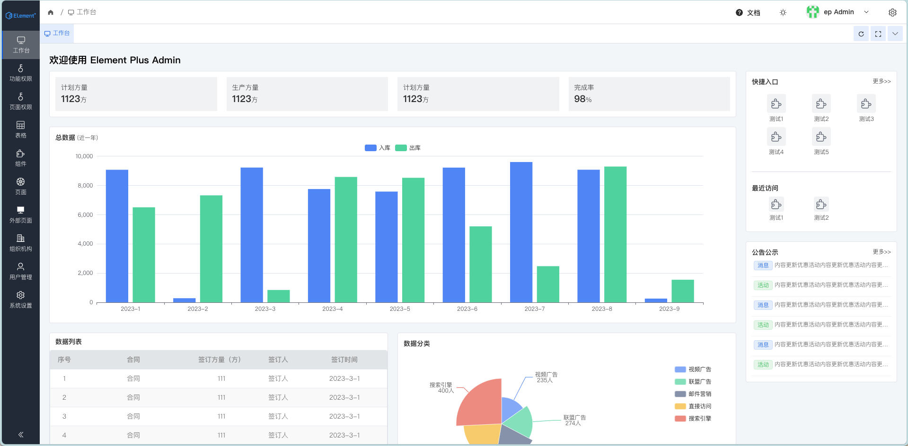

#### 总览

> 基于element-plus的后台管理项目模板.它的技术栈为： vue3 + ts + vite + element-plus + unocss

<p align="center">
    
</p>

### 目录结构
```
├─ packages 模块目录 
│  ├─ admin 管理后台项目
│  ├─ app-[xxx] 分包项目
│  ├─ demo 代码案例 
│  ├─ common-core 通用组件
│  ├─ common-utils 通用工具
│  ├─ mock 接口模拟数据
├─ doc 项目文档
├─ build 打包配置，脚本等
├─ dist 打包结果

```

### js & ts
1. 尽量使用typeScript
1. $http 和 resolveUrl 支持自动导入，各模块可以直接使用。

### 依赖

1. unocss 原子性css 引擎 [官网](https://unocss.dev/) & [交互式文档](https://unocss.dev/interactive/) & [兼容tailwindcss](https://tailwindcss.com/docs/installation)
2. Element-Plus [不兼容变化](https://github.com/element-plus/element-plus/discussions/5657)
3. Vite
4. vue3 
5. dayjs
6. @vueuse 
7. axios
8. lodash
9. @iconify-json icon集 (@iconify-json/ep 是 所有 element-plus 的icon)


###  vscode 扩展
 1. 【必装】volar 
 2. 【必装】eslint 
 3. 【必装】prettier
 4. 【必装】UnoCSS *原子性css输入提示*
 5. Iconify IntelliSense   *预览 Iconify 图标*


### css

* 开发过程中页面禁止写css，推荐使用unocss 
* 内外间距，布局等统一用unocss ：[交互式文档](https://unocss.dev/interactive/)
``` 
<div class="p-1 lg:p-2">

// p-1 => padding: 4px;
// pt-1 => padding-top: 4px;

// m-1 => marigin: 4px;
// mt-1 => marigin-top: 4px;

// 更多请查看文档 
``` 

* 颜色统一使用css 变量 ： --ep- 系列
``` 
// 常用 css函数
getCssVar('button', 'text-color') => var(--el-button-text-color)
getCssVarName('button', 'text-color') => '--el-button-text-color'
getCssVar('color-primary', 'light-9') => var(--el-color-primary-light-9)
```

### mock 模拟数据
使用[Vite-plugin-mock-dev-server](https://vite-plugin-mock-dev-server.netlify.app/) 插件，配置写在 /build/vite/plugin/index.js 中
模拟接口写在 $mock$ 目录中
